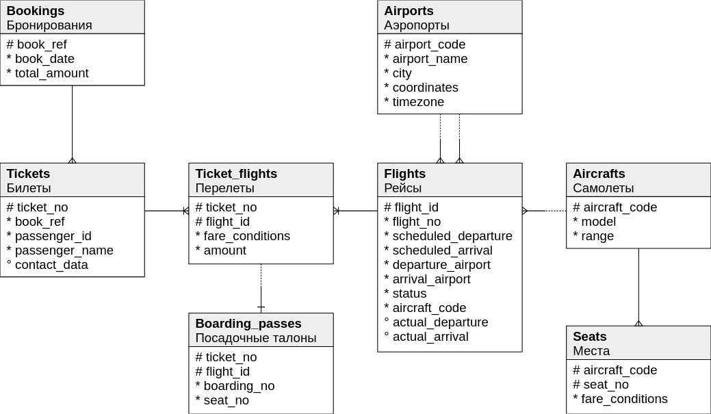

### Using *JDBC* with *Postgres* to get data, create a database, process queries.  

There is a database of air transportation in 2017.

**src/main/java/com.khoribz/domain** - classes with fields of tables  
**src/main/java/com.khoribz/service/dao** - classes for creating, downloading with URL, getting, setting values of the table  
**src/main/java/com.khoribz/service/db** - creation, filling, removal of the databases, JDBC template  
**src/main/java/com.khoribz/App** - program start  
**src/main/java/com.khoribz/Queries** - database queries   
